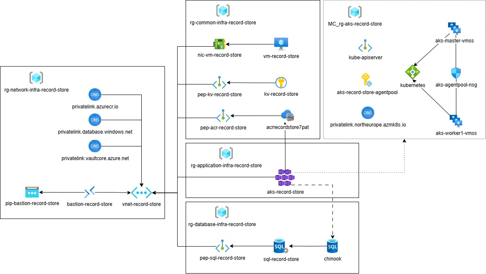

# App on Azure Kubernetes Service
This repository demonstrates how to host the [Record Store Application](https://github.com/MaryKroustali/record_store_app) on Azure Kubernetes Service (AKS), using the container image built in  [containerized_app_on_azure](https://github.com/MaryKroustali/containerized_app_on_azure/pkgs/container/record-store-app). This approach addresses the [limitations](https://github.com/MaryKroustali/containerized_app_on_azure?tab=readme-ov-file#limitations) of lightweight container services.

## Architecture

The following architecture illustrates the deployment of the containerized application on AKS:

### Node Resource Group (MC)

When deploying AKS as an infrastructure-as-a-service solution, Azure automatically creates a second resource group (`MC_rg-aks-record-store`) that contains the underlying infrastructure components such as Virtual Machine Scale Sets, a Load Balancer and a Network Interface Card for the Kubernetes nodes.
For a detailed description, refer to [Core concepts for AKS](https://learn.microsoft.com/en-us/azure/aks/core-aks-concepts).

#### Authorization to the ACR

To allow the AKS cluster to pull images from Azure Container Registry (ACR), the kubelet identity located in the MC resource group is granted the `ACRPull` role assignment on the registry.

## Kubernetes Resources

The [manifests](./manifests/) folder contains Kubernetes YAML files used to deploy and expose the application.

### Application Resources

- Namespace: A namespace named `application` isolates the application resources.
- Deployment: A Deployment creates two replicas (Pods) running the containerized application, exposing port `8080`.
- Service: A ClusterIP Service exposes the application internally on port `8080`.

### Ingress Controller (NGINX)

To make the application publicly accessible, an ingress controller is introduced.

The NGINX Ingress Controller is deployed using the official [static manifest](https://github.com/kubernetes/ingress-nginx/blob/main/deploy/static/provider/cloud/deploy.yaml).

After setting up NGINX, an  Ingress  resource is created in the     `application` namespace, routing external traffic to the internal application service.

## Github Workflows
The CI/CD workflows are structured similarly to those in the [containerized_app_on_azure](https://github.com/MaryKroustali/containerized_app_on_azure/blob/main/README.md#github-actions), with minor adjustments for AKS deployment:
- `Deploy Infrastructure`: Creates all the necessary Azure resources.

- `Push Image to ACR`: Tags and pushes the Docker image to ACR, using the Linux Github Runner.
- `Import Data to Database`: Importing data into the SQL database, using the Windows Github Runner.
- `Deploy to AKS`: Applies Kubernetes manifests to deploy the application on the AKS cluster.

# Next Steps
[app_on_aks_gitops](https://github.com/MaryKroustali/app_on_aks_gitops): Managing Kubernetes deployments on Azure Kubernetes Service using GitOps principles with ArgoCD.
